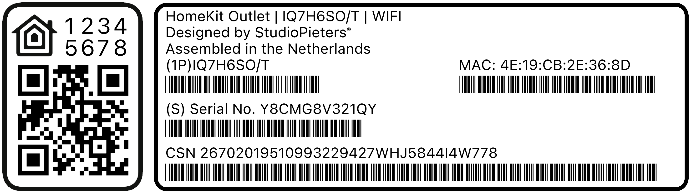

# ESP32-Homekit-QRCode

Easily generate HomeKit QR code labels for your ESP32 accessories!  
This Python tool automatically creates a print-ready label including:

- HomeKit Setup Code (with QR code)
- Device Code
- MAC Address
- Serial Number (with barcode)
- CSN (with barcode)
- Neatly aligned and aesthetic layout

Perfect for professionally labeling your DIY HomeKit projects.



---

## Requirements

- Python 3.10+
- Pillow  
  ```bash
  pip install pillow
  ```
- qrcode  
  ```bash
  pip install qrcode
  ```
- `Barcode39.ttf` (included in the repo)
- High-resolution label template (`qrcode_ext.png` is provided)

---

## Installation

Clone the repository:

```bash
git clone https://github.com/AchimPieters/esp32-homekit-qrcode.git
```
```bash
cd esp32-homekit-qrcode
```

---

## Usage

To generate a label, run:

```bash
./gen_qrcode 7 123-45-678 1QJ8 4E19CB2E368D  new/qrcode.png 
```

Each run creates a unique label inside the `/new/` directory, containing:

- A valid HomeKit setup code
- A unique serial number and CSN
- Auto-generated barcodes
- A QR code following Apple HomeKit standards

---

## Printing

The generated PNG file is ready for printing on white label stickers.  
For best results, use a laser printer or a high-resolution inkjet printer.

---

## How It Works

1. Loads the label template (`qrcode_ext.png`)
2. Generates a random HomeKit setup code
3. Creates a QR code
4. Generates device info (MAC, Serial Number, CSN)
5. Positions all elements aesthetically
6. Exports a finished label to `/new/qrcode.png`

---

## Integration

Use together with your own HomeKit firmware:  
[ESP32-Homekit](https://github.com/AchimPieters/esp32-homekit)
[ESP32-Homekit-demo](https://github.com/AchimPieters/esp32-homekit-demo)


---

## Credits

- [Pillow](https://python-pillow.org/)
- [qrcode](https://github.com/lincolnloop/python-qrcode)

